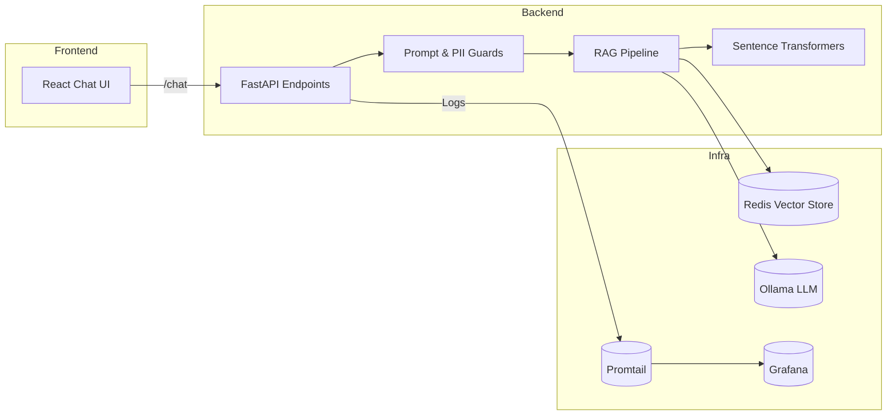

# Warehouse Knowledge Assistant (LLM-RAG)

Ein produktionsnahes Retrieval-Augmented-Generation (RAG) Referenzprojekt für den Demo-Domain "Warehouse Knowledge Assistant". Der Stack kombiniert FastAPI, Redis Vector Store, Sentence Transformers, Ollama, React/TypeScript, Docker-Compose, Observability (Promtail + Grafana) und Security-Guards, um meine Fähigkeiten als AI Software Engineer abzubilden.

## Architektur auf einen Blick


## Features
- **Backend**: FastAPI mit `/health`, `/ingest`, `/chat`, strukturiertes Logging (structlog), Prometheus-Metriken, Prompt-Injection-Guards, PII-Redaction, Audit-Log.
- **Vector Store**: Redis-Stack (HNSW Index) mit Namespace-Management und automatischem Index-Aufbau.
- **LLM-Orchestrierung**: Sentence-Transformers `all-MiniLM-L6-v2` für Embeddings, Ollama (z.B. `llama3`) für die Antwortgenerierung.
- **Frontend**: React + Vite Chat-UI mit Agent-Status, Dark/Light Mode, Quellenanzeige, Retry-/Timeout-Handling.
- **Infra & DevOps**: Docker Compose Stack (FastAPI, Redis, Ollama, Frontend, Promtail, Grafana), Helm Chart Skeleton, GitHub Actions CI, k6 Performance-Skript.
- **Daten & Security**: Seed-Daten (`data/warehouse_faq.md`, `data/warehouse_ops.csv`), Prompt-Guards, Audit-Log, `.env` Handling.

## Repository-Layout
```
backend/   FastAPI Service inkl. Tests & Dockerfile
frontend/  React/Vite Chat Client + Vitest
infra/     Promtail & Grafana Artefakte
charts/    Helm Chart Skeleton für k3s
scripts/   k6 Load-Test Beispiel
docs/      Architektur- & Operations-Dokumente
```

## Setup
### Voraussetzungen
- Python 3.11+
- Node 20 + pnpm (Corepack)
- Docker & Docker Compose (für End-to-End Stack)
- Optional: k6, kubectl, helm

### Lokale Entwicklung
```bash
cp .env.example .env
make install-backend
make install-frontend
```

Seed-Daten laden:
```bash
curl -X POST http://localhost:8000/ingest \
  -H 'Content-Type: application/json' \
  -d '{"documents": [{"path": "data/warehouse_faq.md", "mime_type": "text/markdown"}, {"path": "data/warehouse_ops.csv", "mime_type": "text/csv"}]}'
```

Chat-Aufruf:
```bash
curl -X POST http://localhost:8000/chat \
  -H 'Content-Type: application/json' \
  -d '{"query": "Wie hoch ist der Dock-Durchsatz?"}'
```

### Tests & Qualität
```bash
make test-backend
make test-frontend
make lint
```

### Docker Compose
```bash
docker compose up --build
```
- Backend: `http://localhost:8000`
- Frontend: `http://localhost:5173`
- Grafana: `http://localhost:3000` (admin/admin per Default)

### k6 Performance-Test
```bash
k6 run scripts/k6-load.js
```
Ziel: p95 < 1s bei 10 VUs (simuliert ~3M Token/Tag bei Skalierung).

### Helm (optional)
```bash
helm install warehouse charts/warehouse-rag --namespace rag --create-namespace
```
Passe `values.yaml` an (Images, Service-Typ, Ressourcen).

## Sicherheit & Observability
- Prompt-Injection-Heuristiken + Blocklist.
- Regex-basierte PII-Maskierung (E-Mail / Telefonnummern).
- Audit-Log (`logs/audit.log`) + Promtail-Scraping → Grafana Dashboard (`infra/grafana-dashboard.json`).
- Prometheus Metriken (`/metrics`): Request-Counter, Retrieval-/LLM-Latenz, Guard-Hits.
- `.env` Workflow, keine Secrets im Repo.

## Dokumentation
- `docs/architecture.md`: Komponenten- & Sequenzdiagramm, Datenfluss.
- `docs/operations.md`: Deploy-, Monitoring- & Cost-Guides.

## Business Use-Cases
- Warehouse FAQs (Inbound/Outbound KPIs, SOPs)
- Putaway/Picking Priorisierung
- Compliance Checks (PII-Masking, Prompt Guards)
- Agent-Status für Leitstand-Transparenz

## Roadmap / TODOs
- Automatisierte PDF-Ingestion Smoke-Tests
- Alerting Rules für Guard-Hits > Schwelle
- Browser-Plugin (Skeleton vorhanden in Planung)
- Erweiterte Telemetrie via OpenTelemetry Collector

Lizenz: [MIT](LICENSE)
