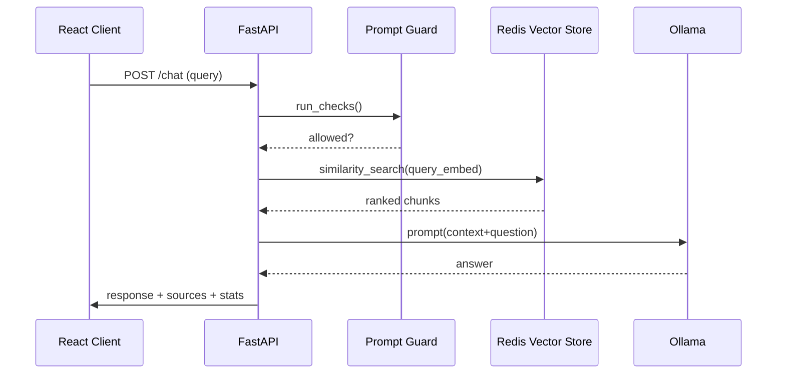

# Architektur

## Komponenten
- **FastAPI Backend**: Endpunkte `/health`, `/ingest`, `/chat`, Instrumentierung, Guards.
- **RAG Pipeline**: SentenceTransformer Embeddings → Redis Vector Store Retrieval → Guarding → Ollama Generation.
- **Frontend**: React Chat UI mit Agent-Status, Theme Toggle, Quellenanzeige.
- **Observability**: structlog JSON Logs → Promtail → Grafana; Prometheus-Metriken direkt aus FastAPI.
- **Infrastructure**: Docker Compose Stack, optional Helm Deployment.

## Sequenzdiagramm

## Datenfluss
1. **Ingestion**: Parser (Markdown/CSV/PDF) → Chunker → Embedding → Redis HNSW Index.
2. **Retrieval**: Query → Embedding → Vector Similarity (KNN) → Context Kürzung (max chars).
3. **LLM Prompting**: System Prompt + Quellen + Frage, Guard-Feedback, PII-Redaction.
4. **Observability**: structlog JSON, Guard-Hits, Prometheus Latenzen, Audit-Logs.

## Quality Gates
- Pytest + Vitest
- Ruff + Black + ESLint + Prettier
- GitHub Actions (Lint, Tests, Docker Build)
- k6 Performance Baseline
